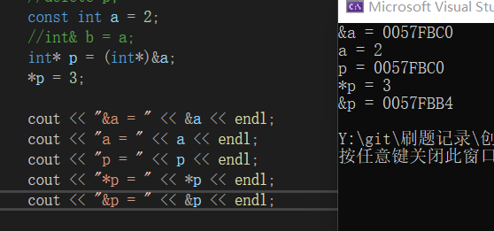
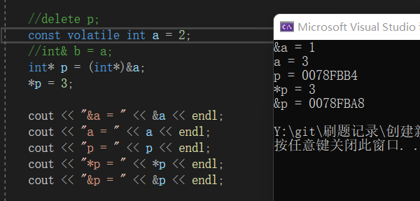
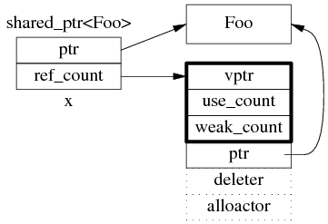

# C/C++

---

## C++特性：封装、继承、多态

封装目的是实现代码模块化。

继承目的是实现代码扩展。

多态目的是分为静态多态和动态多态。静态多态（编译时多态）：函数、操作符重载和泛型编程。动态多态（运行时多态）：虚函数重写。（动态绑定，必须通过基类指针去调用子类重写的函数）

> 多态与虚基类：虚基类是为了解决多继承（菱形继承）时的存储优化和二义性问题，与多态没有关联，而多态是通过继承和虚函数体现出来的。

##  C/C++内存模型

**内核区：** 系统中所有进程对应的虚拟地址空间的内核区都会映射到同一片物理内存

**用户区：**

保留区 - NULL指向的内存

.text - 只读代码段

.data - 数据段，已初始化且初值不为0的全局变量和静态变量，静态存储区，可读可写

.bss - 未初始化以及初始为0的全局变量和静态变量，操作系统将其初始化为0

> bss段和data段的区别：
> 
> 在初始化时.bss段部分将会清零。.bss段属于静态内存分配，即程序一开始就将其清零了。比如，在C语言之类的程序编译完成之后，已初始化的全局变量保存在.data 段中，未初始化的全局变量保存在.bss 段中。
> 
> .text和.data 段都在**可执行文件中**，由系统从可执行文件中加载，其内容由程序初始化;而 .bss段**不在可执行文件中**，不占用.exe的空间，其内容由操作系统初始化。具体体现为一个占位符，仅记录大小，大小是从可执行文件中获得的，链接器得到这个大小的内存块，紧跟在data段后面。不分配存储空间（比如一开始就分配一个int array[3000]，比初始化的int array[3000] = {1,2,3,4}生成的exe文件要小）

heap - 运行时动态分配的内存

- 堆中的内容是**匿名**的（堆和栈空间都是匿名内存，也就是没有对应“存储文件”的内存），不能通过名字直接访问，只能通过指针间接访问
> 
> 匿名内存：来源于swap分区，当一个程序很久没有运行的时候，需要将程序占用的堆 、栈交换到 swap 分区，而程序打开的文件则不需要放到 swap 分区，因为打开的文件直接可以放到其文件系统， swap 分区还包括堆栈中的一些状态和变量数据等。可以用vmstat监测，比如procs下的w反映固定时间段内需要释放、交换出去的进程数量，memory下的swpd表示swap空间的大小，si和so分别表示每秒换回/换出的内存总量

- **低地址向高地址增长**（向上增长），这是因为堆内存空间是不连续的，操作系统用链表来管理存储空间，链表是从低地址向高地址遍历的

内存映射区（mmap） - 加载磁盘文件或运行过程中的动态库

stack - 存储函数内部声明的非静态局部变量，函数参数，函数返回地址等信息，由编译器自动分配释放，向下增长，地址连续

命令行参数 - main函数的参数

环境变量 - 存储和运行相关的环境变量，如工作路径、进程所有者信息等

> windows内存分析工具：vmmap，VLD（内存泄漏检测），vs性能监测工具
> 
> [Linux内存分析/检测工具](https://www.bilibili.com/read/cv3791320#)：vmstat，静态分析工具 BEAM、动态监测工具 Valgrind 和 rational purify  

## 构造与析构顺序，为什么

在实例化一个类对象之后，首先执行的是这个类的初始化列表部分

构造时：基类构造函数→对象成员构造函数→派生类本身的构造函数

析构时：派生类本身的析构函数→对象成员析构函数→基类析构函数

1. 先调用父类的构造函数，再初始化成员，最后调用自己的构造函数
2. 先调用自己的析构函数，再析构成员，最后调用父类的析构函数
3. 如果父类定义了有参数的构造函数，则自己也必须自定义带参数的构造函数
4. 多继承时，调用顺序取决于class D: public Base2, public Base1, public Base的顺序，也就是先调用Base2,再Base1，再Base（注意不是初始化列表的顺序！）。**但是有虚继承的时候，虚继承的构造函数是最优先被调用的**。

为什么是这个顺序？

对于构造函数：根据[类对象分配规则](#详细内存分配规则)也能看出来，继承实际上就是派生类使用基类中定义的成员变量/成员函数，把基类的成员变成自己的成员，会为继承类中变量分配空间。一个类的构造函数中可以使用自己的成员变量/成员函数，如果基类的构造在派生类之后，那么派生类就无法使用自己的成员变量/成员函数（先构造，再使用）

析构函数：假如基类的析构函数调用先于子类，类成员终止了，而类本身却还在；但是在类存在的情况下，类成员就应该还存在的，这就产生了矛盾。所以子类是调用自身的析构函数再调用基类的析构函数。

> 注意！如果让父类指针指向子类对象，需要把父类的析构函数设置成虚函数，否则delete时可能会使程序崩溃（未定义行为）并可能会造成内存泄漏，
> 
> 这是因为：当在堆栈里主动创建对象时,对象的大小和它们的声明周期被准确地内置在生成的代码里，编译器知道确切的类型、数量和范围。delete释放指针指向地址的存储空间，具体释放多少，是通过**检查指针的类型**来判断，因此父类指针指向子类只析构了父类对象，没有释放子类的存储空间
> 
> if the static type of the object to be deleted is different from its dynamic type, the static type shall be a base class of the dynamic type of the object to be deleted and the static type shall have a virtual destructor or the behavior is undefined.

## new和delete

[参考](https://blog.csdn.net/zpznba/article/details/89676271)

**new的原理**

new简单类型直接调用operator new分配内存；而对于复杂结构，先调用operator new分配内存，然后在分配的内存上**调用构造函数**；

对于简单类型，new[]计算好大小后调用operator new；对于复杂数据结构，new[]先调用operator new[] 分配一块足够大的，匿名的内存空间（堆内存），然后在p的前四个字节写入数组大小n，然后调用n次构造函数，返回一个指向该内存区域的指针。

**delete的原理**

delete简单数据类型默认只是调用free函数；复杂数据类型先调用析构函数再调用operator delete；

针对简单类型，delete和delete[] 等同。假设指针p指向new[] 分配的内存。因为要4字节存储数组大小，实际分配的内存地址为p-4，系统记录的也是这个地址。delete[]实际释放的就是p-4指向的内存。而delete会直接释放p指向的内存，这个内存根本没有被系统记录，所以会崩溃。

> 注意：分配的堆内存不释放会造成内存泄漏，但是大部分操作系统会记录哪些内存由哪些进程使用，所以会在进程结束后自动回收内存。但是但是，还是要记得即时释放减少程序对内存资源的占用。

> 构造函数不能是虚函数的原因：虚函数调用是在部分信息下完成工作的机制，允许我们只知道接口而不知道对象的确切类型。要创建一个对象，需要知道对象的确切类型等完整信息，以完成内存分配。因此，构造函数不应该被定义为虚函数。虚函数的作用在于通过子类的指针或引用来调用父类的那个成员函数。而构造函数是在创建对象时自己主动调用的，不可能通过子类的指针或者引用去调用。

## malloc分配规则、内存边界对齐及malloc的线程安全

[内核内存管理](./os.md/#linux内存管理)

[STL内存池](STL.md/#stl内存配置器)

1. 用一次malloc申请多个（数组）地址的是连续地址 。

2. 多次malloc申请地址，地址并不是连续的，但系统会在每次malloc时，从相隔固定长度起开始分配，这就涉及到**内存边界对齐**。

**内存边界对齐**

这是为了让内存存取更有效率而采用的一种编译阶段优化内存存取的手段。内存对齐是指**首地址对齐**

**为什么要有内存对齐**

- 有些CPU可以访问任意地址上的任意数据，而有些CPU只能在特定地址访问数据，因此不同硬件平台具有差异性，这样的代码就不具有移植性，如果在编译时，将分配的内存进行对齐，这就具有平台可以移植性了
- CPU每次寻址都是要消费时间的，并且并不是逐个字节访问，而是以字长（word size）为单位访问，所以数据结构应该尽可能地在自然边界上对齐，如果访问未对齐的内存，处理器需要做两次内存访问，而对齐的内存访问仅需要一次访问，内存对齐后可以提升性能。

**内存对齐规则**

- 基本类型的对齐值就是其sizeof值;
- 数据成员对齐规则：结构(struct)(或联合(union))的数据成员，第一个数据成员放在offset为0的地方，以后每个数据成员的对齐按照#pragma pack指定的数值和这个数据成员自身长度中，比较小的那个进行;
- 结构(或联合)的整体对齐规则：在数据成员完成各自对齐之后，结构(或联合)本身也要进行对齐，对齐将按照#pragma pack指定的数值和结构(或联合)最大数据成员长度中，比较小的那个进行;

除了#pragma pack(n)，还有__attribute((aligned (n)))也可以让所作用的结构成员对齐在n字节自然边界上。如果结构中有成员的长度大于n，则按照最大成员的长度来对齐。

> 也可以用位域、位段来节省存储空间

**malloc的线程安全**

**malloc函数线程安全的**，malloc函数在用户空间要自己管理各进程共享的内存链表（glibc），或者访问内核的共享数据结构（buddy），由于有共享资源访问，本身会造成线程不安全。为了做到线程安全，需要加锁进行保护。

**但是，malloc函数是不可重入的**，因为涉及到全局堆上的操作

## struct和class的区别

[参考](https://blog.csdn.net/alidada_blog/article/details/83419757)

保留struct是为了向下兼容，面向过程的语义中数据和数据操作是分开的

区别：

1. 默认的继承访问权限，struct是public，class是private
2. 默认的访问权限
3. struct不能用于定义模板参数

> 也有说struct是值类型，class是引用类型，但是C++里面貌似没有引用类型的说法

## 类对象的内存布局

[参考](https://blog.csdn.net/u013010889/article/details/76473515)

每个对象所占用的存储空间只是该对象的数据部分（虚函数指针和虚基类指针也属于数据部分）所占用的存储空间，而不包括函数代码所占用的存储空间。在C++类对象模型中，类的所有普通成员函数都被放在一个特殊的位置，所有这个类的对象都共用这份成员函数。

为了保证每个对象拥有彼此独立的内存地址，C++空类的内存大小为**1字节**。非空类的大小与类中非静态成员变量和虚函数表的多少有关。其中，类中非静态成员变量的大小则与编译器的位数以及内存对齐的设置有关。

类中的成员变量在内存中并不一定是连续的。它是按照编译器的设置，按照内存块来存储的，这个内存块大小的取值，就是[内存对齐](#malloc分配规则内存边界对齐及malloc的线程安全)。

虚函数：子类在初始化时会复制父类的虚函数表，如果子类中有同名函数，则会覆盖复制过来的虚函数表，而且当子类对象通过父类指针调用虚函数时，会用虚函数调用子类自己的函数产生多态。调用普通函数不会经过虚函数表，是静态绑定的（在**编译期**便决定了调用地址偏移量，**总是会调用指针类型定义中的那个方法**）

C++只能通过指针和引用表现多态，把一个派生类对象直接赋给基类对象，相当于是把派生类的内存截断，只保留了基类大小的内存。这是因为，指针和引用类型只是要求了基地址和这种指针所指对象的内存大小，与对象的类型无关，相当于把指向的内存解释成指针或引用的类型。而把一个派生类对象直接赋值给基类对象，就牵扯到对象的类型问题，编译器就会回避之前的的虚机制。从而无法实现多态。

在子类中重写父类的非虚函数在设计上是矛盾的：

- 一方面，父类定义了普通函数`func`，意味着它反映了父类的不变式。子类重写后父类的不变式不再成立，因而子类和父类不再是"is a"的关系。
- 另一方面，如果`func`应当在子类中提供不同的实现，那么它就不再反映父类的不变式。它就应该声明为`virtual`函数。

### 详细内存分配规则

[参考](https://blog.csdn.net/bailang_zhizun/article/details/117124494#)

VS

1. 普通类对象

    在类对象进行内存分配时，按照类的成员变量所占用的总字节数申请内存（需满足[内存对齐](#内存边界对齐)的原则），其中内存空间是按照成员变量声明的顺序来申请的，然后对象的地址就是申请的总的内存空间首地址。

    注意：不包括函数代码所占用的存储空间

2. 包含虚函数的对象

    在开头增加一个4字节的vptr指针（指向虚函数表），

    

3. 普通派生类

    对象的地址即为内存空间的首地址，先存放基类的成员变量，然后再存放自己（派生类）的成员变量，成员函数的地址依然没有什么关联。

    3.1 派生类没有重写虚基类的虚函数

    

    派生类不继承基类的vptr指针，每个类只包含一个vptr指针

    在派生类的虚函数表中，优先存储的是基类的虚函数指针，然后再存储派生类的虚函数指针（按函数声明顺序），而且在派生类的虚函数表中，存储的继承自基类的虚函数指针与基类中存储的虚函数指针完全一致，这说明，如果派生类没有重写基类的虚函数，那么在进行多态操作时，如果调用派生类的虚函数（与基类同名的虚函数），是不会发生多态行为的，调用的仍然是基类的虚函数

    3.2 派生类重写了基类的虚函数

    

4. 多重继承

    4.1 普通多重继承

    按**基类在初始化列表中的构造顺序**安排成员变量

    4.2 含有虚函数的多重继承，派生类重写部分虚函数

    

5. 多重虚继承

    <html>

        class A {     //基类
            public:
	        int dataA;
        };
        
        class B : virtual public A {
        public:
            int dataB;
        };
        
        class C : virtual public A {
        public:
            int dataC;
        };
        
        class D: public B, public C {
        public:
            int dataD;
        };

    </html>

    5.1 单一虚继承（class B 、 class C）
    
    多了一个vbptr指针，~~指向父类的虚函数表~~指向虚基类表，与前面的普通继承不一样，**B类的成员在A类的成员之前**

    

    5.2 多重虚继承

    在D类中，首先存放基类B（继承的第一个类）的vptr指针和成员变量，接下来存放基类C的vptr指针和成员变量，紧接着存放D（自己的）成员变量，最后是间接基类A的成员变量（只有一个）。

    

    5.3 虚继承 + 虚函数

    <html>

        class A1{
        public:
            virtual void vf(){ cout << "virtual A1::vf" << endl; }
            int dataA;
        };
        
        class B1 : virtual public A1{
        public:
            virtual void vf(){ cout << "virtual b1::vf" << endl; }
            int dataB;
        };
        
    </html>

    ~~虚基类表指针去哪了...~~
    注意：对于在对象中存取虚基类的问题，虚基类表仅是Microsoft编译器的解决办法。在其他编译器中，一般采用在虚函数表中放置虚基类的偏移量的方式。

    

总结：虚函数表指针永远在最前，对于虚函数表，要按构造顺序来，按基类的虚函数表指针-基类成员变量的顺序排布，然后是自己的虚函数指针，自己的成员变量，然后是虚基类表指针，只存在一份拷贝的（间接基类）成员变量通常在最后

另：虚函数表一般存放在只读数据段.rodata（位于.data和.text之间）中，因为是class specific的，而虚函数则位于代码段（.text），也就是C++内存模型中的代码区。

## 虚继承（与虚函数的区别）

（已经不认识虚这个字了）

虚继承是解决C++多重继承问题的一种手段，从不同途径继承来的同一基类，会在子类中存在多份拷贝。这将存在两个问题：**其一，浪费存储空间；第二，存在二义性问题**，通常可以将派生类对象的地址赋值给基类对象，实现的具体方式是，将基类指针指向继承类（继承类有基类的拷贝）中的基类对象的地址，但是多重继承可能存在一个基类的多份拷贝，这就出现了二义性。

虚继承底层实现原理与编译器相关，一般通过虚基类指针和虚基类表实现，**每个虚继承的子类都有一个虚基类指针（占用一个指针的存储空间，32位编译器4字节）和虚基类表（不占用类对象的存储空间）**（需要强调的是，虚基类依旧会在子类里面存在拷贝，只是仅仅最多存在一份而已，并不是不在子类里面了）；当虚继承的子类被当做父类继承时，虚基类指针也会被继承。

vbptr指的是虚基类表指针（virtual base table pointer），该指针指向了一个虚基类表（virtual table），虚表中记录了虚基类与本类的偏移地址；通过偏移地址，这样就找到了虚基类成员，而虚继承也不用像普通多继承那样维持着公共基类（虚基类）的两份同样的拷贝，节省了存储空间。

**以对比虚函数的实现原理**：

他们有相似之处：

1. 都利用了**虚指针**（均占用类的存储空间）和**虚表**（均不占用类的存储空间）。
2. 虚基类依旧存在继承类中，只占用存储空间；虚函数不占用存储空间。
3. 虚基类表存储的是虚基类**相对直接继承类的偏移**；而虚函数表存储的是虚函数地址。

## static关键字

**静态局部变量**

使用static修饰符定义的局部变量，即使在声明时未赋初值，编译器也会把它初始化为0，存储于进程的全局数据区（.bss或.data段），即使函数返回，它的值也会保持不变。

**全局静态变量**

普通全局变量对整个工程可见，其他文件可以使用extern外部声明后直接使用。也就是说其他文件不能再定义一个与其相同名字的变量了（否则编译器会认为它们是同一个变量）。

静态全局变量仅对当前文件可见，其他文件不可访问，其他文件可以定义与其同名的变量，两者互不影响。

作用：降低不同模块之间的耦合

**静态函数**

同全局静态变量

**类的静态数据成员**

静态数据成员存储在全局数据区，静态数据成员在定义时分配存储空间，所以不能在类声明中定义，要额外在类外定义（初始化）

静态数据成员是类的成员，无论定义了多少个类的对象，静态数据成员的拷贝只有一个，且对该类的所有对象可见。也就是说任一对象都可以对静态数据成员进行操作。而对于非静态数据成员，每个对象都有自己的一份拷贝。

优势：

- 静态数据成员没有进入程序的全局名字空间，因此不存在与程序中其它全局名字冲突的可能性
- 可以实现信息隐藏。静态数据成员可以是private成员，而全局变量不能

**类的静态成员函数**

与静态数据成员类似，静态成员函数属于整个类，而不是某一个对象，所以没有this指针，它无法访问属于类对象的非静态数据成员，也无法访问非静态成员函数，它只能调用其余的静态成员函数。
出现在类体外的函数定义不能指定关键字static

对于采用静态局部变量的单例模式

**为什么是静态局部变量可以保证线程安全性？**

原因是Magic Static特性（C++11）。如果变量在初始化时，并发线程同时进入到static声明语句，并发线程会阻塞等待初始化结束。这样可以保证在获取静态局部变量的时候一定是初始化过的，所以具有线程安全性，同时也避免了new对象时指令重排序造成对象初始化不完全的现象。并且相比较与使用智能指针以及mutex来保证线程安全和内存安全来说，这样做能够提升效率。

局部静态变量的构造在全局静态变量之后，释放在全局静态变量之前，与他们的声明顺序无关，另外全局静态变量的构造顺序是按声明顺序来的，析构是逆序

## Volatile关键字

volatile 关键字是一种类型修饰符，用它声明的类型变量表示可以被某些编译器未知的因素更改，比如：操作系统、硬件或者其它线程等。遇到这个关键字声明的变量，编译器对访问该变量的代码就不再进行优化，从而可以提供对特殊地址的稳定访问。

声明时语法：int volatile vInt;

当要求使用 volatile 声明的变量的值的时候，系统总是重新从它所在的内存读取数据，即使它前面的指令刚刚从该处读取过数据。而且读取的数据立刻被保存。

volatile指针（和const类似）

- (1) 可以把一个非volatile int赋给volatile int，但是不能把非volatile对象赋给一个volatile对象。
- (2) 除了基本类型外，对用户定义类型也可以用volatile类型进行修饰。
- (3) C++中一个有volatile标识符的类只能访问它接口的子集，一个由类的实现者控制的子集。用户只能用const_cast来获得对类型接口的完全访问。此外，volatile像const一样会从类传递到它的成员。

**多线程下的volatile**

有些变量是用 volatile 关键字声明的。当两个线程都要用到某一个变量且该变量的值会被改变时，应该用 volatile 声明，该关键字的作用是防止优化编译器把变量从内存装入 CPU 寄存器中。如果变量被装入寄存器，那么两个线程有可能一个使用内存中的变量，一个使用寄存器中的变量，这会造成程序的错误执行。volatile 的意思是让编译器每次操作该变量时一定要从内存中真正取出，而不是使用已经存在寄存器中的值。

## 如何修改const变量的值

强制转换 + volatile，还要看编译器怎么优化

or

<html>

    const int a = 1;
    int *p;
    p = const_cast<int*>(&a)

</html>

## 引用与指针的区别

引用是别名，指针是地址，

**使用指针的一个理由是在作用域以外使用引用语义**。

对这句话的理解

<html>

int& func(){
    A a;
    return a;
}

int* func(int){
    A* p = new A;
    return p;
}

</html>

引用也是为了更好地支持**操作符重载**

<html>

    //你和你的代码让我感到可笑
    A c = &a + &b;

    A oprator+(A* const a, A* const b)
    {
        return *a + *b;
    }

</html>

## 智能指针

### shared_ptr

shared_ptr会在**拷贝构造**或**赋值**时增加引用计数，析构时减少引用计数

shared_ptr 是引用计数型（reference counting）智能指针，几乎所有的实现都采用在**堆（heap）**上放个计数值（count）的办法（除此之外理论上还有用循环链表的办法，不过没有实例）。具体来说，shared_ptr<Foo> 包含两个成员，一个是指向 Foo 的指针 ptr，另一个是 ref_count 指针（其类型不一定是原始指针，有可能是 class 类型，但不影响这里的讨论），指向堆上的 ref_count 对象。ref_count 对象有多个成员，具体的数据结构如图 1 所示，其中 deleter 和 allocator 是可选的。

关于shared_ptr线程安全问题

[参考](https://blog.csdn.net/solstice/article/details/8547547)

步骤1：

shared_ptr<Foo> x(new Foo);

步骤2：

shared_ptr<Foo> y = x;

在执行步骤2的过程中，也就是当智能指针发生拷贝的时候，标准的实现是先拷贝智能指针，再拷贝引用计数对象（拷贝引用计数对象的时候，会使use_count加一），**这两个操作并不是原子的，也就是两个拷贝操作并不是同时发生的**，如果是多线程交替读写共享的shared_ptr，就可能会出现问题。具体可以见原文

unique_ptr和shared_ptr转换所有权

std::move()

## 宏和inline的区别

1. **宏定义不是函数**，但是使用起来像函数。预处理器用复制宏代码的方式代替函数的调用，省去了函数压栈退栈过程，提高了效率。**内联函数本质上是一个函数**，内联函数一般用于函数体的代码比较简单的函数，不能包含复杂的控制语句，while、switch，并且内联函数本身不能直接调用自身。如果内联函数的函数体过大，编译器会自动的把这个内联函数变成普通函数。
2. 宏定义是在**预编译**的时候把所有的宏名用宏体来替换，简单的说就是字符串替换。内联函数则是在**编译**的时候进行代码插入，编译器会在每处调用内联函数的地方直接把内联函数的内容展开，这样可以省去函数的调用的开销，提高效率
3. **宏定义是没有类型检查的，无论对还是错都是直接替换，而内联函数在编译时进行安全检查。内联函数在编译的时候会进行类型的检查，内联函数满足函数的性质，比如有返回值、参数列表等**

**内联函数与static修饰函数的区别：**

内联函数不用开栈清栈；相同点是所修饰的函数都是本文件可见（起因不同前者是代码展开，后者是static修饰造成生成符号为local属性）

**static inline**

GCC中static inline定义比较容易理解：可以将其看做是在static函数前面加上了inline属性。这个函数的大部分属性和static函数一样，只不过在调用这个函数的时候，gcc会在其调用处将其汇编代码展开编译而不为这个函数生成独立的汇编代码。除了以下情况外：

1. 函数的地址被使用时，如果通过函数指针对函数进行了间接调用的时候，这种情况下就不得不为static inline函数生成独立的汇编码，否则它没有自己的地址

2. 其他一些无法展开的情况，比如函数本身有递归调用自己的情况。

**inline**

在它定义所在的文件内，它的表现和static inline的表现一致：再能展开的时候被内联展开编译。但是为了能够在文件外面调用它，gcc一定会为它生成一份独立的汇编代码，以便在文件外部进行调用

## NULL和nullptr的区别

NULL是一个空指针(void*)0

C++中使用重载的例子，由于C语言的隐式类型转换导致产生了二义性

<html>

    #include <iostream>
    using namespace std;

    void func(int x) {
        cout<<"void func(int x)"<<endl;
    }

    void func(char *y) {
        cout<<"void func(int *y)"<<endl;
    }

    int main()
    {
        func(NULL);
        return 0;
    }

</html>

## 强制转换

**static_cast**

[参考](https://blog.csdn.net/qq_42567607/article/details/124455805)

基本等价于隐式转换的一种类型转换运算符，以前是编译器自动隐式转换，static_cast可使用于需要明确隐式转换的地方。c++中用static_cast用来表示明确的转换。

可以用于低风险的转换：

- 整型和浮点型

- 字符与整形

- 转换运算符

- 空指针转换为任何目标类型的指针

不可以用与风险较高的转换：

- 不同类型的指针之间互相转换

- 整型和指针之间的互相转换

- 不同类型的引用之间的转换

**const_cast**

const_cast的对象类型必须为指针引用或指向对象的指针

作用是去除const限定，因为有的函数参数要求const类型

常成员函数的this指针为const xxx型（void func() const），即指向的地方的数据不能变，于是使用const_cast去除this指针的const限定符

- 常量指针被转化成非常量的指针，并且仍然指向原来的对象；
- 常量引用被转换成非常量的引用，并且仍然指向原来的对象；
- const_cast一般用于修改指针。如const char *p形式。
- const_cast不能修改const数据本身的值，但是可以去掉const指针的const属性来改变其指向的值

**dynamic_cast**

通过RTTI（运行时类型识别）来做转换，而RTTI通过虚函数来实现，

一般用于将父类指针转化为子类指针

**reinterpret_cast**

高风险转换
