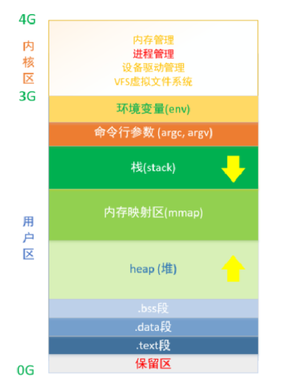
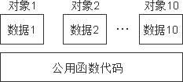
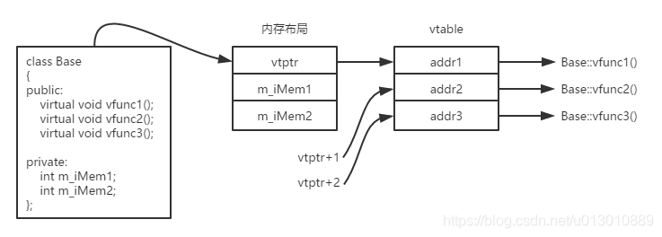
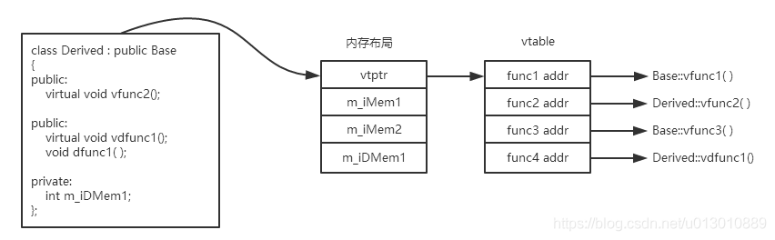
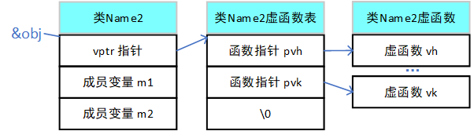
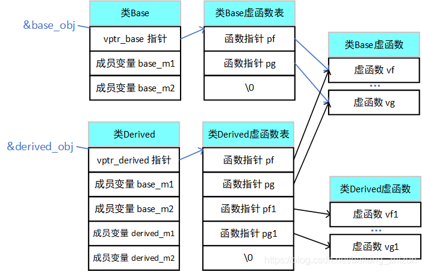
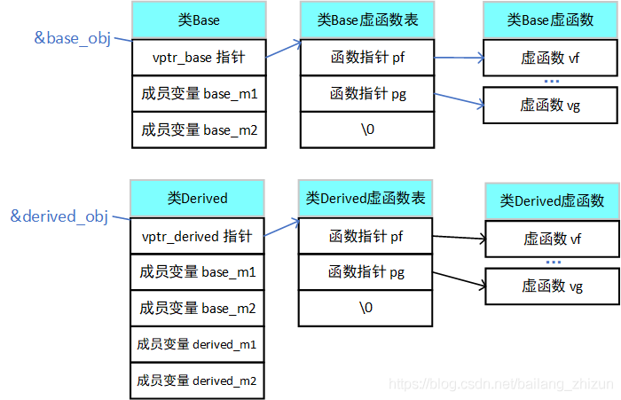
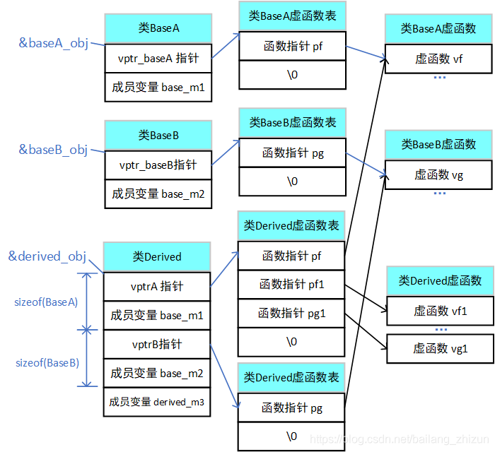
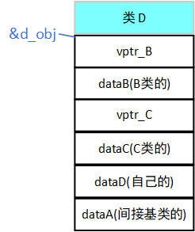
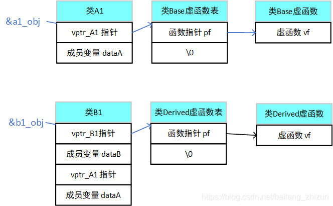

# C/C++

<!-- vscode-markdown-toc -->
* 1. [ C/C++内存模型](#CC)
* 2. [构造与析构顺序，为什么](#)
* 3. [new和delete](#newdelete)
* 4. [malloc分配规则、内存边界对齐及malloc的线程安全](#mallocmalloc)
* 5. [struct和class的区别](#structclass)
* 6. [类对象的内存布局](#-1)
	* 6.1. [详细内存分配规则](#-1)

<!-- vscode-markdown-toc-config
	numbering=true
	autoSave=true
	/vscode-markdown-toc-config -->
<!-- /vscode-markdown-toc -->


---

面向对象特征：封装，继承，多态

封装目的是实现代码模块化，隐藏对象内部细节，控制对象的修改访问权限

继承目的是实现代码扩展，可以把共性的属性和方法定义在父类中，通过继承，派生类可以重用继承类中的共性方法和属性（公用代码）。继承的思想是重用和拓展，一个类通过继承获得属性和方法，同时也可以拓展出新的属性和方法

多态目的是分为静态多态和动态多态。静态多态：函数重载和泛型编程。动态多态：虚函数重写。

##  1. <a name='CC'></a> C/C++内存模型



**内核区：** 系统中所有进程对应的虚拟地址空间的内核区都会映射到同一片物理内存

**用户区：**

保留区 - NULL指向的内存

.text - 只读代码段

.data - 数据段，已初始化且初值不为0的全局变量和静态变量，静态存储区，可读可写

.bss - 未初始化以及初始为0的全局变量和静态变量，操作系统将其初始化为0

> bss段和data段的区别：
> 
> 在初始化时.bss段部分将会清零。.bss段属于静态内存分配，即程序一开始就将其清零了。比如，在C语言之类的程序编译完成之后，已初始化的全局变量保存在.data 段中，未初始化的全局变量保存在.bss 段中。
> 
> .text和.data 段都在**可执行文件中**，由系统从可执行文件中加载，其内容由程序初始化;而 .bss段**不在可执行文件中**，不占用.exe的空间，其内容由操作系统初始化。具体体现为一个占位符，仅记录大小，大小是从可执行文件中获得的，链接器得到这个大小的内存块，紧跟在data段后面。不分配存储空间（比如一开始就分配一个int array[3000]，比初始化的int array[3000] = {1,2,3,4}生成的exe文件要小）

heap - 运行时动态分配的内存

- 堆中的内容是**匿名**的（堆和栈空间都是匿名内存，也就是没有对应“存储文件”的内存），不能通过名字直接访问，只能通过指针间接访问
> 
> 匿名内存：来源于swap分区，当一个程序很久没有运行的时候，需要将程序占用的堆 、栈交换到 swap 分区，而程序打开的文件则不需要放到 swap 分区，因为打开的文件直接可以放到其文件系统， swap 分区还包括堆栈中的一些状态和变量数据等。可以用vmstat监测，比如procs下的w反映固定时间段内需要释放、交换出去的进程数量，memory下的swpd表示swap空间的大小，si和so分别表示每秒换回/换出的内存总量

- **低地址向高地址增长**（向上增长），这是因为堆内存空间是不连续的，操作系统用链表来管理存储空间，链表是从低地址向高地址遍历的

内存映射区（mmap） - 加载磁盘文件或运行过程中的动态库

stack - 存储函数内部声明的非静态局部变量，函数参数，函数返回地址等信息，由编译器自动分配释放，向下增长，地址连续

命令行参数 - main函数的参数

环境变量 - 存储和运行相关的环境变量，如工作路径、进程所有者信息等

> windows内存分析工具：vmmap，VLD（内存泄漏检测），vs性能监测工具
> 
> [Linux内存分析/检测工具](https://www.bilibili.com/read/cv3791320#)：vmstat，静态分析工具 BEAM、动态监测工具 Valgrind 和 rational purify  

##  2. <a name=''></a>构造与析构顺序，为什么

在实例化一个类对象之后，首先执行的是这个类的初始化列表部分

构造时：基类构造函数→对象成员构造函数→派生类本身的构造函数

析构时：派生类本身的析构函数→对象成员析构函数→基类析构函数

1. 先调用父类的构造函数，再初始化成员，最后调用自己的构造函数
2. 先调用自己的析构函数，再析构成员，最后调用父类的析构函数
3. 如果父类定义了有参数的构造函数，则自己也必须自定义带参数的构造函数
4. 多继承时，调用顺序取决于class D: public Base2, public Base1, public Base的顺序，也就是先调用Base2,再Base1，再Base（注意不是初始化列表的顺序！）。**但是有虚继承的时候，虚继承的构造函数是最优先被调用的**。

为什么是这个顺序？

对于构造函数：根据[类对象分配规则](#详细内存分配规则)也能看出来，继承实际上就是派生类使用基类中定义的成员变量/成员函数，把基类的成员变成自己的成员，会为继承类中变量分配空间。一个类的构造函数中可以使用自己的成员变量/成员函数，如果基类的构造在派生类之后，那么派生类就无法使用自己的成员变量/成员函数（先构造，再使用）

析构函数：假如基类的析构函数调用先于子类，类成员终止了，而类本身却还在；但是在类存在的情况下，类成员就应该还存在的，这就产生了矛盾。所以子类是调用自身的析构函数再调用基类的析构函数。

> 注意！如果让父类指针指向子类对象，需要把父类的析构函数设置成虚函数，否则delete时可能会使程序崩溃（未定义行为）并可能会造成内存泄漏，
> 
> 这是因为：当在堆栈里主动创建对象时,对象的大小和它们的声明周期被准确地内置在生成的代码里，编译器知道确切的类型、数量和范围。delete释放指针指向地址的存储空间，具体释放多少，是通过**检查指针的类型**来判断，因此父类指针指向子类只析构了父类对象，没有释放子类的存储空间
> 
> if the static type of the object to be deleted is different from its dynamic type, the static type shall be a base class of the dynamic type of the object to be deleted and the static type shall have a virtual destructor or the behavior is undefined.

##  3. <a name='newdelete'></a>new和delete

[参考](https://blog.csdn.net/zpznba/article/details/89676271)

**new的原理**

new简单类型直接调用operator new分配内存；而对于复杂结构，先调用operator new分配内存，然后在分配的内存上**调用构造函数**；

对于简单类型，new[]计算好大小后调用operator new；对于复杂数据结构，new[]先调用operator new[] 分配一块足够大的，匿名的内存空间（堆内存），然后在p的前四个字节写入数组大小n，然后调用n次构造函数，返回一个指向该内存区域的指针。

**delete的原理**

delete简单数据类型默认只是调用free函数；复杂数据类型先调用析构函数再调用operator delete；

针对简单类型，delete和delete[] 等同。假设指针p指向new[] 分配的内存。因为要4字节存储数组大小，实际分配的内存地址为p-4，系统记录的也是这个地址。delete[]实际释放的就是p-4指向的内存。而delete会直接释放p指向的内存，这个内存根本没有被系统记录，所以会崩溃。


> 注意：分配的堆内存不释放会造成内存泄漏，但是大部分操作系统会记录哪些内存由哪些进程使用，所以会在进程结束后自动回收内存。但是但是，还是要记得即时释放减少程序对内存资源的占用。

> 构造函数不能是虚函数的原因：虚函数调用是在部分信息下完成工作的机制，允许我们只知道接口而不知道对象的确切类型。要创建一个对象，需要知道对象的确切类型等完整信息，以完成内存分配。因此，构造函数不应该被定义为虚函数。虚函数的作用在于通过子类的指针或引用来调用父类的那个成员函数。而构造函数是在创建对象时自己主动调用的，不可能通过子类的指针或者引用去调用。

##  4. <a name='mallocmalloc'></a>malloc分配规则、内存边界对齐及malloc的线程安全

[内核内存管理](./os.md/#linux内存管理)

[STL内存池](STL.md/#stl内存配置器)

1. 用一次malloc申请多个（数组）地址的是连续地址 。

2. 多次malloc申请地址，地址并不是连续的，但系统会在每次malloc时，从相隔固定长度起开始分配，这就涉及到**内存边界对齐**。


**内存边界对齐**

这是为了让内存存取更有效率而采用的一种编译阶段优化内存存取的手段。内存对齐是指**首地址对齐**

**为什么要有内存对齐**

- 有些CPU可以访问任意地址上的任意数据，而有些CPU只能在特定地址访问数据，因此不同硬件平台具有差异性，这样的代码就不具有移植性，如果在编译时，将分配的内存进行对齐，这就具有平台可以移植性了
- CPU每次寻址都是要消费时间的，并且并不是逐个字节访问，而是以字长（word size）为单位访问，所以数据结构应该尽可能地在自然边界上对齐，如果访问未对齐的内存，处理器需要做两次内存访问，而对齐的内存访问仅需要一次访问，内存对齐后可以提升性能。

**内存对齐规则**

- 基本类型的对齐值就是其sizeof值;
- 数据成员对齐规则：结构(struct)(或联合(union))的数据成员，第一个数据成员放在offset为0的地方，以后每个数据成员的对齐按照#pragma pack指定的数值和这个数据成员自身长度中，比较小的那个进行;
- 结构(或联合)的整体对齐规则：在数据成员完成各自对齐之后，结构(或联合)本身也要进行对齐，对齐将按照#pragma pack指定的数值和结构(或联合)最大数据成员长度中，比较小的那个进行;

除了#pragma pack(n)，还有__attribute((aligned (n)))也可以让所作用的结构成员对齐在n字节自然边界上。如果结构中有成员的长度大于n，则按照最大成员的长度来对齐。

> 也可以用位域、位段来节省存储空间

**malloc的线程安全**

一个函数要做到线程安全，需要解决多个线程调用函数时访问共享资源的冲突。而一个函数要做到可重入，需要不在函数内部使用静态或全局数据，不返回静态或全局数据，也不调用不可重入函数。

**malloc函数线程安全但是不可重入的**，不可重入的原因：malloc函数在用户空间要自己管理各进程共享的内存链表，由于有共享资源访问，本身会造成线程不安全。为了做到线程安全，需要加锁进行保护。同时这个锁必须是递归锁，因为如果当程序调用malloc函数时收到信号，在信号处理函数里再调用malloc函数，如果使用一般的锁就会造成死锁（信号处理函数中断了原程序的执行），所以要使用递归锁。
至于malloc函数访问内核的共享数据结构可以正常的加锁保护，因为一个进程程调用malloc函数进入内核时，必须等到返回用户空间前夕才能执行信号处理函数，这时内核数据结构已经访问完成，内核锁已释放，所以不会有问题


##  5. <a name='structclass'></a>struct和class的区别

[参考](https://blog.csdn.net/alidada_blog/article/details/83419757)

保留struct是为了向下兼容，面向过程的语义中数据和数据操作是分开的

区别：

1. 默认的继承访问权限，struct是public，class是private
2. 默认的访问权限
3. struct不能用于定义模板参数

> 也有说struct是值类型，class是引用类型，但是C++里面貌似没有引用类型的说法


##  6. <a name='-1'></a>类对象的内存布局

[参考](https://blog.csdn.net/u013010889/article/details/76473515)

每个对象所占用的存储空间只是该对象的数据部分（虚函数指针和虚基类指针也属于数据部分）所占用的存储空间，而不包括函数代码所占用的存储空间。在C++类对象模型中，类的所有普通成员函数都被放在一个特殊的位置，所有这个类的对象都共用这份成员函数。



为了保证每个对象拥有彼此独立的内存地址，C++空类的内存大小为**1字节**。非空类的大小与类中非静态成员变量和虚函数表的多少有关。其中，类中非静态成员变量的大小则与编译器的位数以及内存对齐的设置有关。

类中的成员变量在内存中并不一定是连续的。它是按照编译器的设置，按照内存块来存储的，这个内存块大小的取值，就是[内存对齐](#malloc分配规则内存边界对齐及malloc的线程安全)。

虚函数：子类在初始化时会复制父类的虚函数表，如果子类中有同名函数，则会覆盖复制过来的虚函数表，而且当子类对象通过父类指针调用虚函数时，会用虚函数调用子类自己的函数产生多态。调用普通函数不会经过虚函数表，是静态绑定的（在**编译期**便决定了调用地址偏移量，**总是会调用指针类型定义中的那个方法**）

C++只能通过指针和引用表现多态，把一个派生类对象直接赋给基类对象，相当于是把派生类的内存截断，只保留了基类大小的内存。这是因为，指针和引用类型只是要求了基地址和这种指针所指对象的内存大小，与对象的类型无关，相当于把指向的内存解释成指针或引用的类型。而把一个派生类对象直接赋值给基类对象，就牵扯到对象的类型问题，编译器就会回避之前的的虚机制。从而无法实现多态。




在子类中重写父类的非虚函数在设计上是矛盾的：

- 一方面，父类定义了普通函数`func`，意味着它反映了父类的不变式。子类重写后父类的不变式不再成立，因而子类和父类不再是"is a"的关系。
- 另一方面，如果`func`应当在子类中提供不同的实现，那么它就不再反映父类的不变式。它就应该声明为`virtual`函数。

###  6.1. <a name='-1'></a>详细内存分配规则

[参考](https://blog.csdn.net/bailang_zhizun/article/details/117124494#)

VS

1. 普通类对象

    在类对象进行内存分配时，按照类的成员变量所占用的总字节数申请内存（需满足[内存对齐](#内存边界对齐)的原则），其中内存空间是按照成员变量声明的顺序来申请的，然后对象的地址就是申请的总的内存空间首地址。

    注意：不包括函数代码所占用的存储空间

2. 包含虚函数的对象

    在开头增加一个4字节的vptr指针（指向虚函数表），

    

3. 普通派生类

    对象的地址即为内存空间的首地址，先存放基类的成员变量，然后再存放自己（派生类）的成员变量，成员函数的地址依然没有什么关联。

    3.1 派生类没有重写虚基类的虚函数

    

    派生类不继承基类的vptr指针，每个类只包含一个vptr指针

    在派生类的虚函数表中，优先存储的是基类的虚函数指针，然后再存储派生类的虚函数指针（按函数声明顺序），而且在派生类的虚函数表中，存储的继承自基类的虚函数指针与基类中存储的虚函数指针完全一致，这说明，如果派生类没有重写基类的虚函数，那么在进行多态操作时，如果调用派生类的虚函数（与基类同名的虚函数），是不会发生多态行为的，调用的仍然是基类的虚函数

    3.2 派生类重写了基类的虚函数

    

4. 多重继承

    4.1 普通多重继承

    按**基类在初始化列表中的构造顺序**安排成员变量

    4.2 含有虚函数的多重继承，派生类重写部分虚函数

    

5. 多重虚继承

    ```c++

        class A {     //基类
            public:
	        int dataA;
        };
        
        class B : virtual public A {
        public:
            int dataB;
        };
        
        class C : virtual public A {
        public:
            int dataC;
        };
        
        class D: public B, public C {
        public:
            int dataD;
        };

    ```

    5.1 单一虚继承（class B 、 class C）
    
    多了一个vbptr指针，指向父类的虚函数表，与前面的普通继承不一样，**B类的成员在A类的成员之前**

    

    5.2 多重虚继承

    在D类中，首先存放基类B（继承的第一个类）的vptr指针和成员变量，接下来存放基类C的vptr指针和成员变量，紧接着存放D（自己的）成员变量，最后是间接基类A的成员变量（只有一个）。

    

    5.3 虚继承 + 虚函数

    ```c++

        class A1{
        public:
            virtual void vf(){ cout << "virtual A1::vf" << endl; }
            int dataA;
        };
        
        class B1 : virtual public A1{
        public:
            virtual void vf(){ cout << "virtual b1::vf" << endl; }
            int dataB;
        };
        
    ```

    


总结：虚函数表指针永远在最前，对于虚函数表，要按构造顺序来，按基类的虚函数表指针-基类成员变量的顺序排布，然后是自己的虚函数指针，自己的成员变量，然后是虚基类表指针，只存在一份拷贝的（间接基类）成员变量通常在最后

