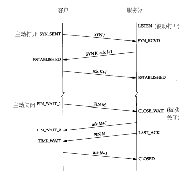

# 计算机网络

---

TCP/IP协议是大端模式，x86 CPU是小端模式

## 半连接状态

客户端向服务端发起连接请求，服务器第一次收到客户端的SYN之后，就会处于SYN_RCVD状态，此时双方还没有完全建立其连接，服务器会把此种状态下请求连接放到一个队列里，我们将这种队列称之为半连接队列。

全连接队列就是已经完成了三次握手，建立起连接就会放到全连接队列中去，如果全连接队列满了就可能会出现丢包的现象。

还有一种半连接状态 出现在四次握手中，主动关闭连接的一方向被动方发送FIN包，被动方返回ACK，此时主动方处于一种

补充

关于SYN-ACK重传次数的问题

服务器发送完SYN-ACK包，如果未收到客户端确认包，服务器进行首次重传，等待一段时间仍未收到客户确认包，进行第二次重传。如果重传次数超过系统规定的最大重传次数，系统将该连接信息从半连接队列中删除。
每次重传等待的时间一般不同，一般是指数增长。如时间间隔是1，2，4，8

## 为什么是三次握手和四次挥手

三次握手是为了让双方确认对方和自己的收发状态没有异常

第一次：己方发送ok
第二次：对方接收和发送ok
第三次：己方接收ok

四次挥手，全双工，断开连接都要各自发送FIN和ACK

## IO多路复用

单线程或单进程同时监测若干个文件描述符是否可以执行IO操作的能力。

本质上是将轮询多个文件描述符的功能转交给内核来做

select，poll和epoll

### select

select的调用会阻塞到有文件描述符可以进行IO操作或被信号打断或者超时才会返回。用户仍然要遍历一遍数组以确定是哪个文件描述符返回

select将监听的文件描述符分为三组，每一组监听不同的需要进行的IO操作。readfds是需要进行读操作的文件描述符，writefds是需要进行写操作的文件描述符，exceptfds是需要进行异常事件处理的文件描述符。这三个参数可以用NULL来表示对应的事件不需要监听。

当select返回时，每组文件描述符会被select过滤，只留下可以进行对应IO操作的文件描述符。

<html>

#include <sys/select.h>
// 最大监听数为1024
int select(int nfds, fd_set*readfds, fd_set*writefds,
                fd_set*exceptfds,struct timeval*timeout);

</html>

### poll

和select用三组文件描述符不同的是，poll只有一个pollfd数组，数组中的每个元素都表示一个需要监听IO操作事件的文件描述符。events参数是关心的事件，revents是所有内核监测到的事件。去掉了1024个文件描述符的限制

<html>

#include <poll.h>

int poll(struct pollfd *fds, nfds_t nfds, int timeout); 

struct pollfd { 
        
        int fd; /* file descriptor */
        
        short events; /* requested events to watch */

        short revents; /* returned events witnesse */
    };

</html>

### epoll

epoll_create & epoll_create1用于创建一个epoll实例，而epoll_ctl用于往epoll实例中增删改要监测的文件描述符，epoll_wait则用于阻塞的等待可以执行IO操作的文件描述符直到超时。

<html>

#include <sys/epoll.h>

int epoll_create(int size);
int epoll_create1(int flags);

int epoll_ctl(int epfd, int op, int fd, struct epoll_event *event);

int epoll_wait(int epfd, struct epoll_event *events,
            int maxevents, int timeout);

</html>

### select vs epoll

1. select 调用需要传入 fd 数组，需要拷贝一份到内核，高并发场景下这样的拷贝消耗的资源是惊人的。（可优化为不复制）
2. select 在内核层仍然是通过遍历的方式检查文件描述符的就绪状态，是个同步过程，只不过无系统调用切换上下文的开销。（内核层可优化为异步事件通知）
3. select 仅仅返回可读文件描述符的个数，具体哪个可读还是要用户自己遍历。（可优化为只返回给用户就绪的文件描述符，无需用户做无效的遍历）

所以 epoll 主要就是针对这三点进行了改进。

1. 内核中保存一份文件描述符集合，无需用户每次都重新传入，只需告诉内核修改的部分即可。
2. 内核不再通过轮询的方式找到就绪的文件描述符，而是通过异步 IO 事件唤醒。
3. 内核仅会将有 IO 事件的文件描述符返回给用户，用户也无需遍历整个文件描述符集合。

文件描述符以**红黑树**的形态组织

epoll优于poll和select的地方

1. 在需要同时监听的文件描述符数量增加时，select&poll是O(N)的复杂度，epoll是O(1)，在N很小的情况下，差距不会特别大，但如果N很大的前提下，一次O(N)的循环可要比O(1)慢很多，所以高性能的网络服务器都会选择epoll进行IO多路复用。
2. epoll内部用一个文件描述符挂载需要监听的文件描述符，这个epoll的文件描述符可以在多个线程/进程共享，所以epoll的使用场景要比select&poll要多。

## 出现大量TIME_WAIT和CLOSE_WAIT的解决方法

命令

netstat -n | awk '/^tcp/ {++S[$NF]} END {for(a in S) print a, S[a]}’

可以打印查看处于不同状态的端口的数量，NF代表一行有多少个单次，$NF表示最后一个单词

### 大量TIME_WAIT

TIME_WAIT是主动关闭连接的一方保持的状态，主要目的是：

1.防止上一次连接中的包，迷路后重新出现，影响新连接（经过2MSL，上一次连接中所有的重复包都会消失）
1. **可靠的关闭TCP连接。在主动关闭方发送的最后一个 ack(fin) ，有可能丢失，这时被动方会重新发fin**, 如果这时主动方处于 CLOSED 状态 ，就会响应 rst 而不是 ack。所以主动方要处于 TIME_WAIT 状态，而不能是 CLOSED 。另外这么设计TIME_WAIT 会定时的回收资源，并不会占用很大资源的，除非短时间内接受大量请求或者受到攻击。

解决方法：使主动关闭连接的一方能快速回收资源，设置端口重用，修改/etc/sysctl.conf文件

### 大量CLOSE_WAIT

CLOSE_WAIT是在被动关闭连接情况下，在已经接收到FIN，**但是还没有发送自己的FIN的时刻**，连接处于CLOSE_WAIT状态。出现大量CLOSE_WAIT的主要原因是某种情况下对方关闭了socket连接，但是我方忙于读或者写，没有关闭连接。

解决方法：查代码

1. 代码需要判断socket，一旦读到0，断开连接，read返回负，检查一下errno，如果不是AGAIN，就断开连接。
2. 给每一个socket设置一个时间戳last_update，每接收或者是发送成功数据，就用当前时间更新这个时间戳。定期检查所有的时间戳，如果时间戳与当前时间差值超过一定的阈值，就关闭这个socket。
3. 使用一个Heart-Beat线程，定期向socket发送指定格式的心跳数据包，如果接收到对方的RST报文，说明对方已经关闭了socket，那么我们也关闭这个socket。
4. 设置SO_KEEPALIVE选项，并修改内核参数

