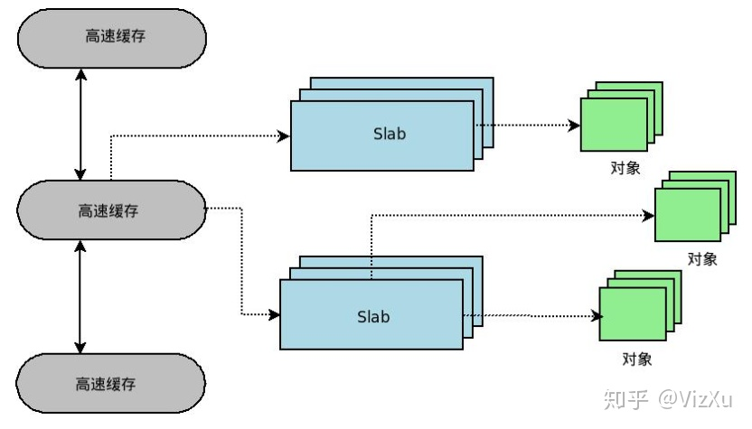
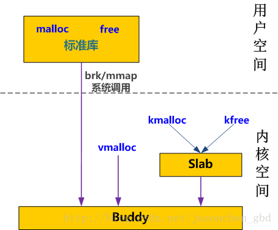
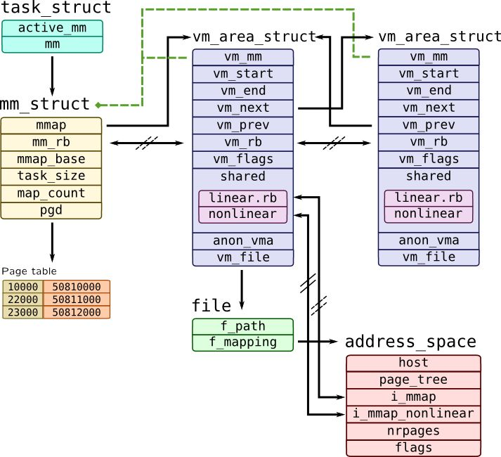
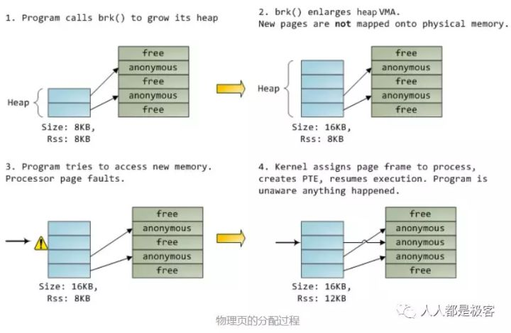
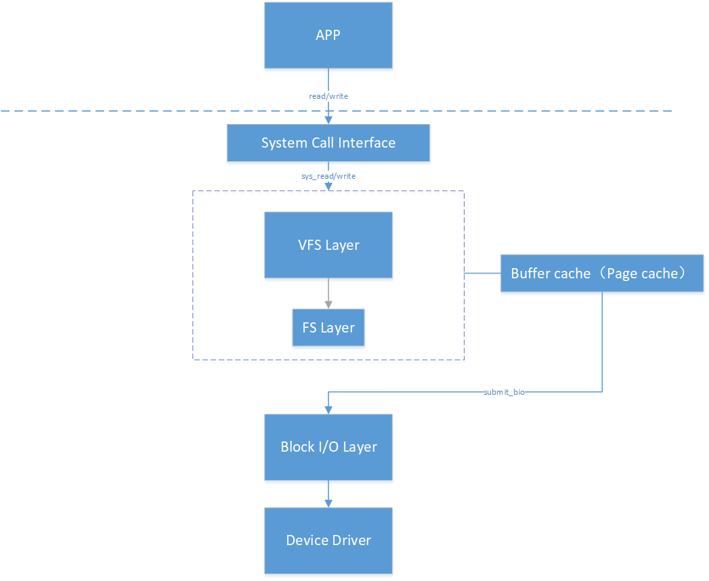
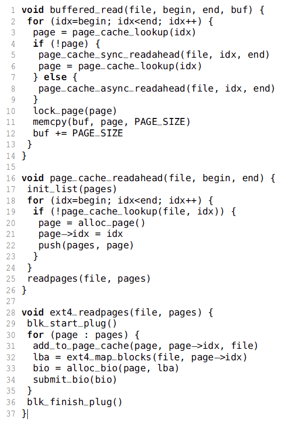
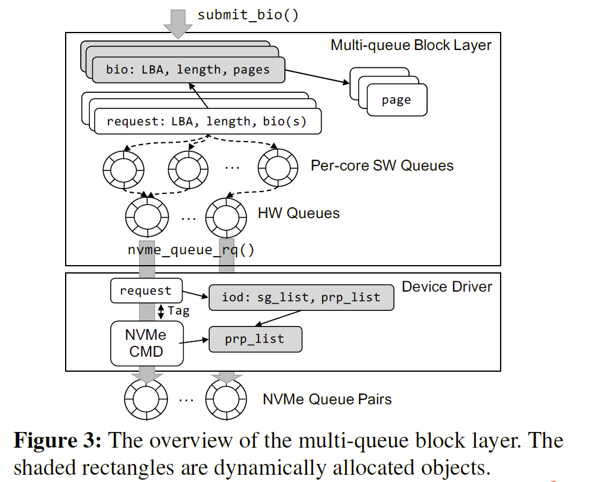

# 操作系统

<!-- vscode-markdown-toc -->
* 1. [Linux内存管理](#Linux)
	* 1.1. [内存碎片](#)
	* 1.2. [伙伴分配器](#-1)
	* 1.3. [slab分配器](#slab)
	* 1.4. [从操作系统角度看malloc](#malloc)
* 2. [内核进程管理](#-1)
	* 2.1. [线程切换](#-1)
* 3. [用户空间和内核空间](#-1)
* 4. [可重入函数和不可重入函数](#-1)
* 5. [为什么要引入虚拟地址](#-1)
* 6. [read/write系统调用过程](#readwrite)
	* 6.1. [Linux I/O堆栈](#LinuxIO)
	* 6.2. [read/write详细过程](#readwrite-1)
* 7. [mmap和DAX](#mmapDAX)
* 8. [守护进程](#-1)
* 9. [文件描述符](#-1)

<!-- vscode-markdown-toc-config
	numbering=true
	autoSave=true
	/vscode-markdown-toc-config -->
<!-- /vscode-markdown-toc -->

---

##  1. Linux内存管理

###  1.1. 内存碎片

1. 内部碎片是由于采用固定大小的内存分区，即以固定的大小块为单位来分配，采用这种方法，进程所分配的内存可能会比所需要的大，这多余的部分便是内部碎片。
2. 外部碎片是由于未分配的连续内存区域太小，以至于不能满足任意进程所需要的内存分配请求，这些小片段且不连续的内存空间被称为外部碎片。

有两种方法可以有效的避免外部碎片：

1. 采用分页技术将不连续的空闲页面映射到连续的线性地址空间中。
2. 开发一种合适的技术来跟踪内存，保证内核在申请一小块内存的情况下，不会从大块的连续空间内截取一小段，从而保证了大块内存的连续性和完整性。

如果采用方案一，势必在每一次映射都要改写内核的页表，进而刷新TLB，这使得分配的速度大大减小。因此，Linux采用方案二来解决外部碎片问题，也就是伙伴（buddy）系统。

###  1.2. 伙伴分配器

[源码分析](https://zhuanlan.zhihu.com/p/526134525)

伙伴系统的宗旨是用最小的内存块来满足内核对于内存的请求。内核中所有空闲页面被分为10个块列表，分别包含1、2、4、8、16、32、64、128、256和512个连续页面框架。块的第一个页帧的物理地址是组大小的倍数，例如，一个16页帧的块的初始地址是$16*2^{12}$的倍数。

内核在基本的伙伴分配器的基础上做了一些扩展。

1. 支持内存节点和区域，称为分区的伙伴分配器(zoned buddy allocator)。
2. 为了预防内存碎片，把物理页根据可移动性分组。
3. 针对分配单页做了性能优化，为了减少处理器之间的锁竞争，在内存区域增加了一个每处理器页集合。

**伙伴分配器的分配释放流程**

伙伴分配器分配和释放物理页的数量单位为阶（order）。分配n阶页块的过程如下：

1）查看是否有空闲的n阶页块，如果有直接分配；否则，继续执行下一步；

2）查看是否存在空闲的（n+1）阶页块，如果有，把（n+1）阶页块分裂为两个n阶页块，一个插入空闲n阶页块链表，另一个分配出去；否则继续执行下一步。

3）查看是否存在空闲的（n+2）阶页块，如果有把（n+2）阶页块分裂为两个（n+1）阶页块，一个插入空闲（n+1）阶页块链表，另一个分裂为两个n阶页块，一个插入空间n阶页块链表，另一个分配出去；如果没有，继续查看更高阶是否存在空闲页块。

内核alloc_pages就是用的伙伴分配器

**伙伴分配器的优缺点**

优点：

由于将物理内存按照PFN（页帧）将不同的page放入到不同order中，根据需要分配内存的大小，计算当前这次分配应该在哪个order中去找空闲的内存块，如果当前order中没有空闲，则到更高阶的order中去查找，因此分配的效率比boot memory的线性扫描bitmap要快很多。

缺点：

1. 释放page的时候调用方必须记住之前该page分配的order，然后释放从该page开始的2order个page，这对于调用者来说有点不方便

2. 因为buddy allocator每次分配必须是2^order个page同时分配，这样当实际需要内存大小小于2^order时，就会造成内存浪费，所以Linux为了解决buddy allocator造成的内部碎片问题，后面会引入**slab分配器**。

###  1.3. slab分配器

[参考](https://zhuanlan.zhihu.com/p/358891862)

在Linux中，伙伴分配器（buddy allocator）是以页为单位管理和分配内存。但在内核中的需求却以字节为单位（在内核中面临频繁的结构体内存分配问题）

task_struct 将近2page 

mm_struct 只占半个page

引入slab分配器弥补内存管理粒度太大的问题，也就是解决内存的内部碎片的问题

核心思想：使用对象的概念来管理内存，这里的对象是指**具有相同数据结构和大小的内存单元**，这样的对象会在内核中被频繁地分配和释放

slab为这样的对象创建一个cache，即缓存。每个cache所占的内存区又被划分多个slab，每个 slab是由一个或多个连续的页框组成。每个页框中包含若干个对象，既有已经分配的对象，也包含空闲的对象。如下所示：

内核对象的管理与用户进程中的堆管理比较相似，核心问题均是：如何高效地管理内存空间，使得可以快速地进行对象的分配和回收并减少内存碎片。但是内核不能简单地采用用户进程的基于堆的内存分配算法，这是因为内核对其对象的使用具有以下特殊性：

1. 内核使用的对象种类繁多，应该采用一种**统一**的高效管理方法。
2. 内核对某些对象（如 task_struct）的使用是非常频繁的，所以用户进程堆管理常用的基于搜索的分配算法比如First-Fit（在堆中搜索到的第一个满足请求的内存块）和 Best-Fit（使用堆中满足请求的最合适的内存块）并不直接适用，而应该采用某种缓冲区的机制。
3. 内核对象中相当一部分成员需要某些特殊的初始化（例如队列头部）而并非简单地清成全 0。如果能充分重用已被释放的对象使得下次分配时无需初始化，那么可以提高内核的运行效率。
4. 分配器对内核对象缓冲区的组织和管理必须充分考虑对硬件高速缓存的影响。
5. 随着共享内存的多处理器系统的普及，多处理器同时分配某种类型对象的现象时常发生，因此分配器应该尽量避免处理器间同步的开销，应采用某种 Lock-Free 的算法

###  1.4. 从操作系统角度看malloc

在linux操作系统中，每个进程都通过一个task_struct的结构体描述，每个进程的地址空间都通过一个mm_struct描述，c语言中的每个段空间都通过vm_area_struct表示，他们关系如下

上图中，task_struct中的mm_struct就代表进程的整个内存资源，mm_struct中的pgd为页表，mmap指针指向的vm_area_struct链表的每一个节点就代表进程的一个虚拟地址空间，即一个VMA。一个VMA最终可能对应ELF可执行程序的数据段、代码段、堆、栈、或者动态链接库的某个部分。

malloc的过程其实就是把VMA分配到各种段当中，这时候是没有真正分配物理地址的。malloc 调用后，**只是分配了内存的逻辑地址**，在内核的mm_struct 链表中插入vm_area_struct结构体，没有分配实际的内存。当分配的区域写入数据是，引发页中断，建立物理页和逻辑地址的映射。下图表示了这个过程。

从操作系统角度来看，进程分配内存有两种方式，分别由两个系统调用完成：brk和mmap（不考虑共享内存）。

- malloc小于128k的内存，使用brk分配内存，将_edata往高地址推(只分配虚拟空间，不对应物理内存(因此没有初始化)，第一次读/写数据时，引起内核缺页中断，内核才分配对应的物理内存，然后虚拟地址空间建立映射关系)
- malloc大于128k的内存，使用mmap分配内存，在堆和栈之间找一块空闲内存分配(对应独立内存，而且初始化为0)

由此可见malloc会lazy allocatoin，除非用户申请后立即对这块内存写0，不然会延迟分配，而kmalloc和vmalloc就是申请了一块就没一块，kmalloc是通过slab拿内存，专用slab主要用于内核各模块的一些数据结构，这些内存是模块启动时就通过**kmem_cache_alloc**分配好占为己有，一些模块自己单独申请一块kmem_cache可以确保有可用内存。而各阶的通用slab则用于给内核中的kmalloc等函数分配内存，alloc_pages、vmalloc是通过buddy拿

而用户态的malloc是通过brk/mmap系统调用每次向内核申请一页，然后在标准库里再做进一步管理供用户程序使用。

##  2. 内核进程管理

一个是最高层次的：mm_struct，一个是较高层次的：vm_area_structs。最高层次的mm_struct结构描述了一个进程的整个虚拟地址空间。较高层次的结构vm_area_truct描述了虚拟地址空间的一个区间（简称虚拟区）。每个进程只有一个mm_struct结构，在每个进程的task_struct结构中，有一个指向该进程的结构。可以说，mm_struct结构是对整个用户空间的描述。

**kernel线程是没有地址空间的，也就没有对应的mm_struct，kernel线程使用之前运行的进程的内存描述符。**

内核的页表在内核初始化的时候就会自己分配好由内核自己管理，每个进程创建的时候拷贝这个资料来初始化自己虚拟地址空间中的内核的部分。也就是说不同进程的虚拟地址空间中内核态的映射规则是一样的。

###  2.1. 线程切换

线程切换主要有两种情况：不同程序的线程，同一程序的不同线程

主要有：用户态→内核态→用户态的转换，CPU Cache、TLB的刷新，保存现场，重新装载IP，SP等，

线程切换开销大概在2~3us左右

##  3. 用户空间和内核空间

**内核空间**中主要负责 **操作系统内核线程**以及**用户程序系统调用**。

**用户空间**主要负责**用户程序的非系统调用**。

**内核空间**比**用户空间**拥有更高的操作级别，只有在**内核空间**中才可以调用操作硬件等核心资源。

当发生用户态和内核态之间的切换的时候，运行栈的信息发生了变化，对应的CPU中的寄存器信息也要发生变换。但是用户线程完成系统调用的时候，还是要切换回用户态，继续执行代码的。所以要将发生系统调用之前的用户栈的信息保存起来，也就是将寄存器中的数据保存到线程所属的某块内存区域。这就涉及到了数据的拷贝，同时用户态切换到内核态还需要安全验证等操作。所以用户态和内核态之间的切换是十分耗费资源的。

用户态切换到内核态的三种方式：
- 系统调用
  - 指的是操作系统提供给用户程序调用的一组特殊接口，用户程序可以根据这组接口获得操作系统内核的服务。它规定了用户进程陷入内核的具体位置，或者说规划了用户访问内核的路径，只能从固定位置进入内核。
- 异常
- 外围设备中断

##  4. 可重入函数和不可重入函数

一个函数要做到线程安全，需要解决多个线程调用函数时访问共享资源的冲突。而一个函数要做到可重入，需要不在函数内部使用静态或全局数据，不返回静态或全局数据，也不调用不可重入函数。

可重入：除了自己堆栈上的变量外不依赖任何环境，可以随时被中断转而执行其它代码，而不会对函数的运行结果产生任何影响

不可重入：使用了一些全局资源，如全局变量包括静态变量、中断向量表等，调度多个进程/线程可能会对这些资源产生一些未知影响

可重入一定线程安全，但线程安全不一定是可重入的，如malloc

##  5. 为什么要引入虚拟地址

[参考1](https://blog.csdn.net/salmonwilliam/article/details/114445320)

[参考2](https://blog.csdn.net/qq_41453285/article/details/107827460)

简单来说，直接使用物理内存面临的主要问题：1.进程地址空间不隔离，恶意篡改、无意的访问越界都会造成进程内存被破坏；2.内存使用效率低，如果此时剩余的内存不够新程序装入，系统可能会将某个运行中的程序拷贝进持久性存储，再将新程序装入；3.程序运行地址不确定，在重新装入程序的时候程序的地址是随机分配的，无法在同一个地址写入两个值，也就是在没有虚拟地址的情况下对物理地址直接操作是有风险的

因此引入虚拟地址空间的概念，程序被“分段”（内核区用户区NULL区和不可操作区这样的段，就是多个固定区域），可以解决问题1和问题3，但是问题2还没解决，因此引入“分页”的概念，即更小粒度的虚拟地址→物理地址的映射，这使得程序的换入和换出不再以整个程序为单位，而是以页为单位，利用空间局部性，将暂时用不到的部分程序代码换入换出

在分段的方法中，每次程序运行时总是把程序全部装入内存，而分页的方法则有所不同。分页的思想是程序运行时用到哪页就为哪页分配内存，没用到的页暂时保留在硬盘上。当用到这些页时再在物理地址空间中为这些页分配内存，然后建立虚拟地址空间中的页和刚分配的物理内存页间的映射。

下面通过介绍一个可执行文件的装载过程来说明分页机制的实现方法。一个**可执行**文件(**PE文件**)其实就是一些编译链接好的数据和指令的集合，它也会被分成很多页，在PE文件执行的过程中，它往内存中装载的单位就是页。当一个PE文件被执行时，操作系统会先为该程序创建一个**4GB**的进程**虚拟地址空间**。因为虚拟地址空间只是一个中间层而已，它的功能是利用一种映射机制将虚拟地址空间映射到物理地址空间，所以，创建4GB虚拟地址空间其实并不是要真的创建空间，只是要创建那种映射机制所需要的数据结构而已，这种数据结构就是**页目**和**页表**。

当创建完虚拟地址空间所需要的数据结构后，进程开始读取PE文件的第一页。在PE文件的第一页包含了PE文件头和段表等信息，进程根据文件头和段表等信息，将PE文件中所有的段一一映射到虚拟地址空间中相应的页(PE文件中的段的长度都是页长的整数倍)。这时PE文件的真正指令和数据还没有被装入内存中，操作系统只是根据PE文件的头部等信息建立了PE文件和进程虚拟地址空间中页的映射关系而已。当CPU要访问程序中用到的某个虚拟地址时，当CPU发现该地址并没有相相关联的物理地址时，CPU认为该虚拟地址所在的页面是个空页面，CPU会认为这是个**页错误**(**Page Fault**)，CPU也就知道了操作系统还未给该PE页面分配内存，CPU会将控制权交还给操作系统。操作系统于是为该PE页面在物理空间中分配一个页面，然后再将这个物理页面与虚拟空间中的虚拟页面映射起来，然后将控制权再还给进程，进程从刚才发生页错误的位置重新开始执行。由于此时已为PE文件的那个页面分配了内存，所以就不会发生页错误了。随着程序的执行，页错误会不断地产生，操作系统也会为进程分配相应的物理页面来满足进程执行的需求。

分页方法的核心思想就是当可执行文件执行到第x页时，就为第x页分配一个内存页y，然后再将这个内存页添加到进程虚拟地址空间的映射表中,这个映射表就相当于一个y=f(x)函数。应用程序通过这个映射表就可以访问到x页关联的y页了。

**每个程序都有自己独立的页表和段表**

不完整的页表，多级页表中的空洞，以及局部性原理只需加载必要的页表来解决页表过大的问题

[参考3](https://www.zhihu.com/question/372211717)

**页是信息的物理单位，大小固定，地址空间唯一；段是信息的逻辑单位，长度取决于用户的程序，地址是二维的（段名+段内地址）**

MMU是处理虚拟地址和物理地址之间的转换的专用硬件结构，TLB是MMU中的高速缓存，在单核发生进程/线程切换时，TLB和CPU Cache都要flush掉

**每个CPU core都有自己的TLB**

##  6. read/write系统调用过程

###  6.1. Linux I/O堆栈

虚拟文件系统（VFS）层提供底层文件系统的抽象。页面缓存层提供文件数据的缓存。文件系统层在块存储之上提供特定于文件系统的实现。块层提供操作系统级的块请求/响应管理和块I/O调度。最后，设备驱动程序处理设备特定的I/O命令提交和完成。

###  6.2. read/write详细过程

1. **用户态**：**应用程序发出read调用请求，系统会在用户空间通过80H中断陷入内核，**接着调用其中断服务例程,即sys_read以进入内核处理流程。
2. **VFS层**：sys_read系统调用最终会落在VFS层页缓存的入口buffer_read，它首先会判断页面是否在缓存中，如果不在，调用page_cache_sync_readahead执行预读，它标识请求的文件范围内所有缺少的索引（第18-19行），分配页面并将页面与缺少的索引相关联（第20-21行）。最后，它请求文件系统读取丢失的页面（第25行），转3。如果缓存页存在于页缓存中，就在后台进行一个异步预读的操作（不在关键路径上）。
3. **进入readpages**：文件系统有自己的readpages（）实现，但它们的行为彼此相似。在Ext4中，Ext4_readpages（）将每个页插入页缓存（第30-31行），检索页的逻辑块地址（LBA）（第32行），并向底层块层（第33-34行）发出块io请求。
4. Linux对线程发出的几个块请求进行批处理，以提高底层请求处理的效率（也称为队列阻塞）。
当调用blk_start_plug（）时（第29行），块请求被收集到当前线程的插件列表中。调用blk_finish_plug（）（第36行）或当前线程开始进行上下文切换时，收集的请求将刷新到块I/O调度程序。
5. 向存储设备发出I/O请求后，线程倒回其调用堆栈，并在函数lock_page（）处被阻塞（第10行）。当IO请求完成之后，中断处理程序释放页的锁，从而唤醒被阻塞的线程。最后，缓存的数据被复制到用户缓冲区（第11-12行）。
6. **块IO层**：下图显示了多队列块层（Linux内核中NVMe SSD的默认块层）和设备驱动程序层的概述。在块层中，使用slab分配器分配bio对象，并将其初始化为包含单个块请求的信息（即LBA、i/O大小和要复制的页）（第33行）。然后，submit_bio（）（第34行）将bio对象转换为请求对象，并将请求对象插入到请求队列中，在那里执行I/O合并和调度。请求对象通过每个核心的软件队列（ctx）和硬件队列（hctx），最终到达设备驱动层。
7. **设备驱动层**：使用nvme_queue_rq（）将请求发送到设备驱动程序。它首先分配一个iod对象，这是一个具有分散/聚集列表的结构，并使用它来执行DMA（直接内存访问）映射，为调度请求中的页分配一个I/O虚拟地址。然后，在NVMe协议中分配prp链表（用来寻址），并用分配的DMA地址填充该链表。最后，使用request和prp_list创建一个NVMe命令，并将其发送到一个NVMe提交队列。在I/O完成时，中断处理程序取消映射页的DMA地址并调用完成函数，最终唤醒被阻塞的线程。

附：多队列块层结构(NVMe Driver)

##  7. mmap和DAX

缓存I/O (Buffered I/O)：大多数操作系统默认的IO操作方式都是缓存IO。该机制使IO数据缓存在操作系统的page cache 中， 也就是说， 数据会被先拷贝到操作系统的内核空间的缓冲区中，然后才会从内核空间的缓冲区拷贝到指定的用户地址空间。其中最典型的就是read/write操作

内存映射I/O(mmap)：通过mmap获得对应文件的一个指针，然后就像操作内存一样进行赋值或者做memcpy/strcpy. 这种我们称之为load/store操作（这种操作一般需要msync、fsync来落盘）。mmap因为建立了文件到用户空间的映射关系，可以看作是把文件直接拷贝到用户空间，减少了一次数据拷贝。但是， mmap依然需要依靠page cache，因为**mmap映射的是文件的页缓存**，而非物理设备中的文件本身，所以在对mmap映射的内存进行修改后，需要用户主动将页缓存同步到磁盘（通过主动调用msync同步或调用munmap接触映射关系，进程退出和系统关机时被动刷回）

DAX(Direct Access)：这个特性是基于mmap的。而DAX的区别在于完全不需要page cache，直接对存储设备进行访问。 所以它就是为了NVDIMM而生的。应用对于mmap的文件操作， 是直接同步到NVDIMM上的。DAX目前在XFS, EXT4, Windows的 NTFS 上都已经支持。需要注意的是， 使用这个模式， 要对应用程序或者文件系统进行修改

##  8. 守护进程

守护进程（Daemon Process），也就是通常说的 Daemon 进程（精灵进程），是 Linux 中的后台服务进程。它是一个生存期较长的进程，通常独立于控制终端并且周期性地执行某种任务或等待处理某些发生的事件。

守护进程是个特殊的孤儿进程，这种进程脱离终端，为什么要脱离终端呢？之所以脱离于终端是为了**避免进程被任何终端所产生的信息所打断**，其在执行过程中的信息也不在任何终端上显示。由于在 Linux 中，每一个系统与用户进行交流的界面称为终端，每一个从此终端开始运行的进程都会依附于这个终端，这个终端就称为这些进程的控制终端，当控制终端被关闭时，相应的进程都会自动关闭。

- 守护进程基本上都是以超级用户启动（ UID 为 0 ）
- 没有控制终端（ TTY 为 ？）
- 终端进程组 ID 为 -1 （ TPGID 表示终端进程组 ID）

一般情况下，守护进程可以通过以下方式启动：

- 在系统启动时由启动脚本启动，这些启动脚本通常放在 /etc/rc.d 目录下；
- 利用 inetd 超级服务器启动，如 telnet 等；
- 由 cron 定时启动以及在终端用 nohup 启动的进程也是守护进程。

##  9. 文件描述符

**进程级别的文件描述符表**：内核为每个进程维护一个文件描述符表，该表记录了文件描述符的相关信息，包括文件描述符、指向打开文件表中记录的指针。
**系统级别的打开文件表**：内核对所有打开文件维护的一个进程共享的打开文件描述表，表中存储了处于打开状态文件的相关信息，包括文件类型、访问权限、文件操作函数(file_operations)等。
**系统级别的 i-node 表**：i-node 结构体记录了文件相关的信息，包括文件长度，文件所在设备，文件物理位置，创建、修改和更新时间等，"ls -i" 命令可以查看文件 i-node 节点

